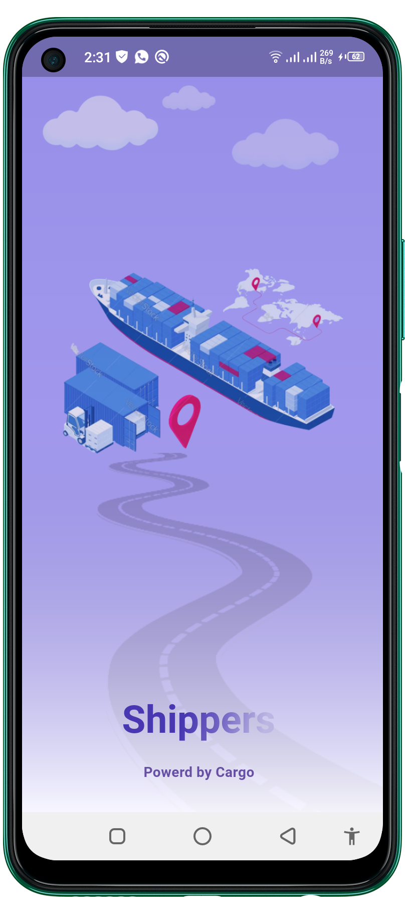

# shipper

A new Flutter project.

# Shipper App 
 <table style='border:none;width:100%'>
  <td style='width:24%;'>
   
  </td>
  <td style='width:24%;'>
  
  </td>
   <td style='width:24%;'>
  
  </td>
   </td>
   <td style='width:24%;'>
  
  </td>
</table>
 <table style='border:none;width:100%'>
  <td style='width:24%;'>
   
  </td>
  <td style='width:24%;'>
  
  </td>
   <td style='width:24%;'>
  
  </td>
   </td>
   <td style='width:24%;'>
  
  </td>
</table>
 <table style='border:none;width:100%'>
  <td style='width:24%;'>
   
  </td>
  <td style='width:24%;'>
  
  </td>
   <td style='width:24%;'>
  
  </td>
   </td>
   <td style='width:24%;'>
  
  </td>
</table>
</table>
 <table style='border:none;width:100%'>
  <td style='width:24%;'>
   
  </td>
  <td style='width:24%;'>
  
  </td>
   <td style='width:24%;'>
  
  </td>
   </td>
   <td style='width:24%;'>
  
  </td>
</table>
</table>
 <table style='border:none;width:100%'>
  <td style='width:24%;'>
   
  </td>
  <td style='width:24%;'>
  
  </td>
   <td style='width:24%;'>
  
  </td>
   </td>
   <td style='width:24%;'>
  
  </td>
</table>

## Getting Started

This project is a starting point for a Flutter application.

A few resources to get you started if this is your first Flutter project:

- [Lab: Write your first Flutter app](https://docs.flutter.dev/get-started/codelab)
- [Cookbook: Useful Flutter samples](https://docs.flutter.dev/cookbook)

For help getting started with Flutter development, view the
[online documentation](https://docs.flutter.dev/), which offers tutorials,
samples, guidance on mobile development, and a full API reference.
